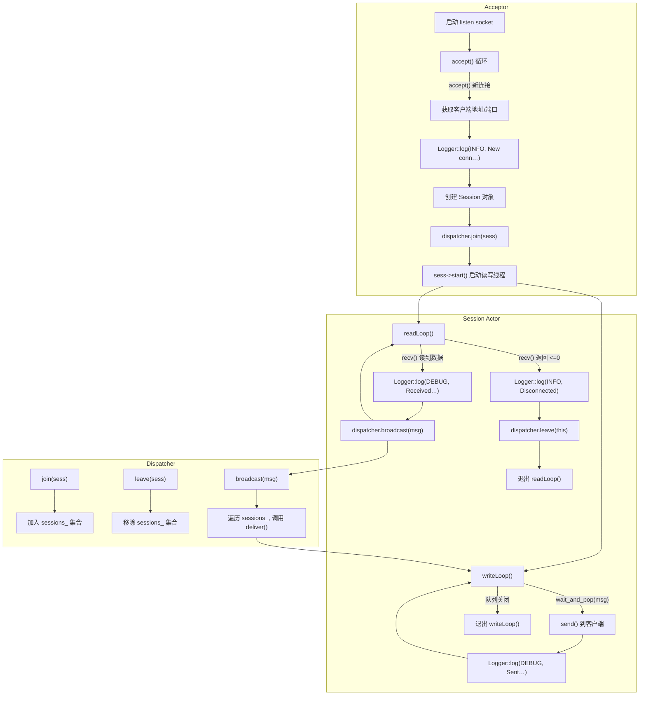

# 流程图

```mermaid
flowchart TD
  subgraph Acceptor
    A1[启动 listen socket] --> A2["accept() 循环"]
    A2 -->|"accept() 新连接"| A3["获取客户端地址/端口"]
    A3 --> A4["Logger::log(INFO, New conn…)"]
    A4 --> A5["创建 Session 对象"]
    A5 --> A6["dispatcher.join(sess)"]
    A6 --> A7["sess->start() 启动读写线程"]
  end

  subgraph Session [Session Actor]
    direction TB
    S1["readLoop()"] -->|"recv() 读到数据"| S2["Logger::log(DEBUG, Received…)"]
    S2 --> S3["dispatcher.broadcast(msg)"]
    S3 --> S1

    S1 -->|"recv() 返回 <=0"| S4["Logger::log(INFO, Disconnected)"]
    S4 --> S5["dispatcher.leave(this)"]
    S5 --> S6["退出 readLoop()"]

    S7["writeLoop()"] -->|"wait_and_pop(msg)"| S8["send() 到客户端"]
    S8 --> S9["Logger::log(DEBUG, Sent…)"]
    S9 --> S7
    S7 -->|队列关闭| S10["退出 writeLoop()"]
  end

  subgraph Dispatcher
    D1["join(sess)"] --> D2["加入 sessions_ 集合"]
    D3["leave(sess)"] --> D4["移除 sessions_ 集合"]
    D5["broadcast(msg)"] --> D6["遍历 sessions_, 调用 deliver()"]
  end

  A7 --> S1
  A7 --> S7
  S3 --> D5
  D6 --> S7

```
