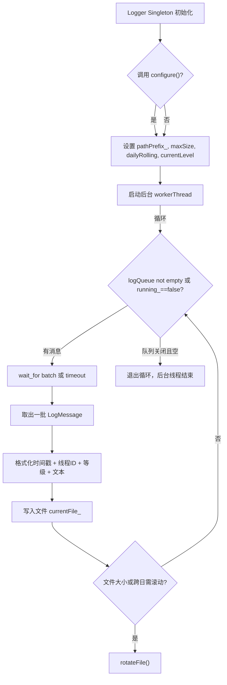

#

```mermaid
flowchart TD
    A[Logger Singleton 初始化] --> B{"调用 configure()?"}
    B -- 是 --> C[设置 pathPrefix_, maxSize, dailyRolling, currentLevel]
    B -- 否 --> C
    C --> D[启动后台 workerThread]
    D -->|循环| E{logQueue not empty 或 running_==false?}
    E -- 有消息 --> F[wait_for batch 或 timeout]
    F --> G[取出一批 LogMessage]
    G --> H[格式化时间戳 + 线程ID + 等级 + 文本]
    H --> I[写入文件 currentFile_]
    I --> J{文件大小或跨日需滚动?}
    J -- 是 --> K["rotateFile()"]
    J -- 否 --> E
    E -- 队列关闭且空 --> L[退出循环，后台线程结束]
```